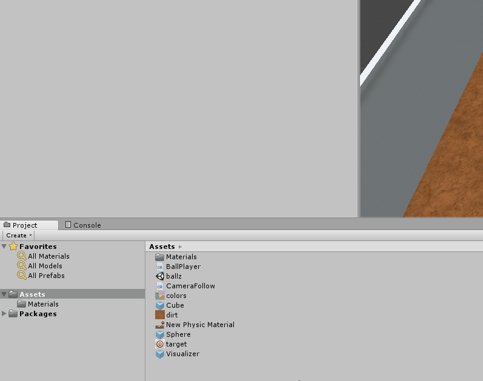
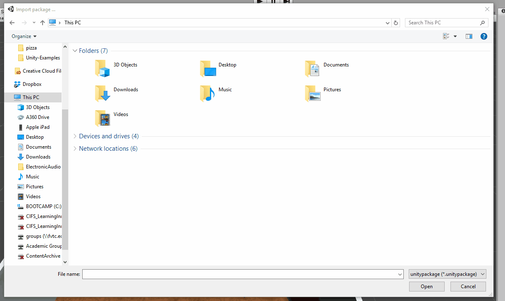
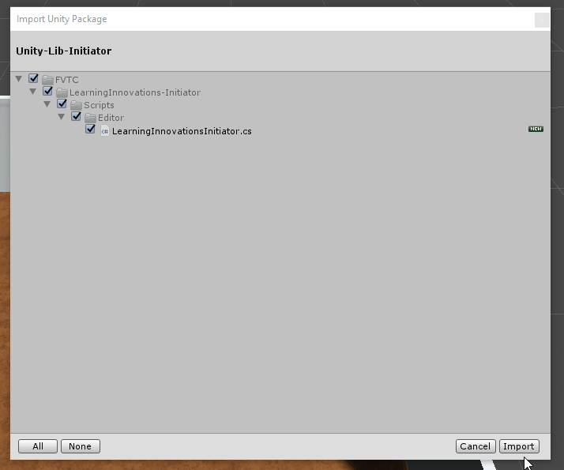
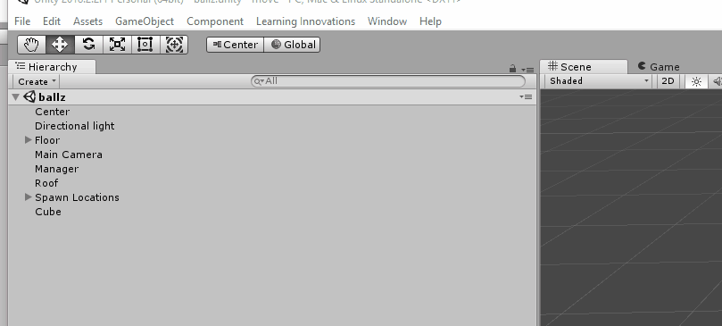
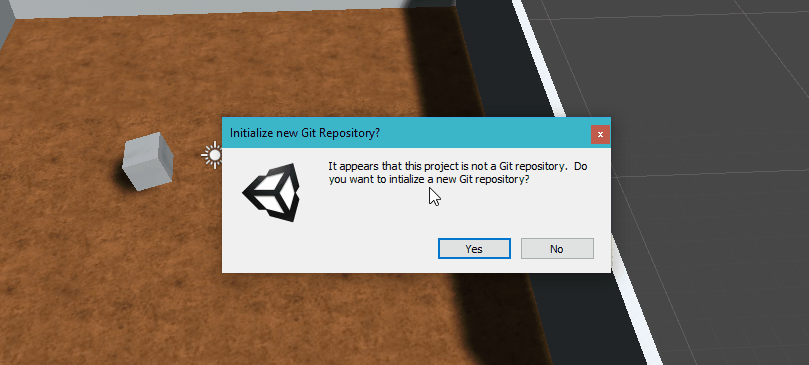

# Unity-Lib-Initiator
A Unity Package to help jumpstart using the Unity-Lib repo.

## Download From [Releases](https://github.com/Wisc-Online/Unity-Lib-Initiator/releases/)
Download the pre-built Unity Package from [releases](https://github.com/Wisc-Online/Unity-Lib-Initiator/releases/) and import in your existing Unity Project to get started.

## Usage
1. Download the Unity Package from [Releases](https://github.com/Wisc-Online/Unity-Lib-Initiator/releases/).
2. Choose to import the Unity Package in your Unity project.

3. Select the downloaded Unity Package.

4. Select the items to import (there's only one script).

5. Click the  `Learning Innovations` -> `Install Unity-Lib` menu item (which was added by the Unity Package) to add the [Unity-Lib](https://github.com/Wisc-Online/Unity-Lib) Git repository as a Git Submodule.

6.  If your Unity Project is not already using Git for source control, it will prompt you to initialize it as a new Git repository.

Now the latest code from the Unity-Lib git repository is added as a Git Submodule.

See the [Unity-Lib](https://github.com/Wisc-Online/Unity-Lib) repository for more documentation.